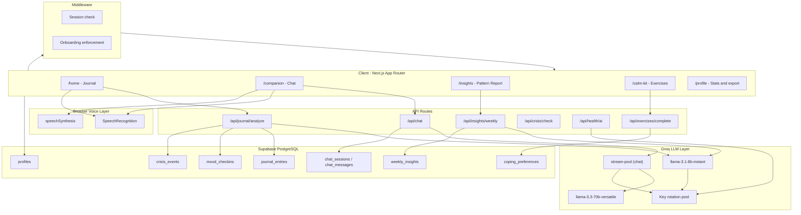
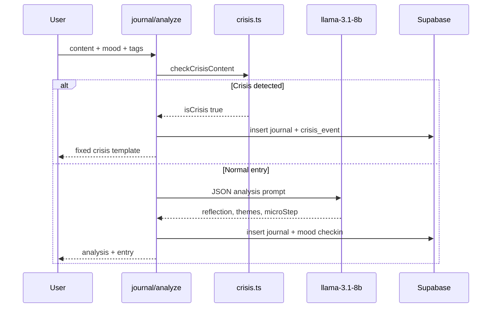
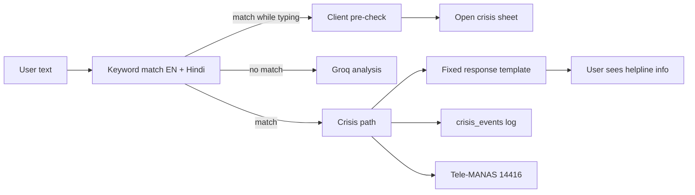

# Saathi Architecture

Technical architecture of the Saathi empathetic AI companion — how the Next.js frontend, Groq AI layer, and Supabase backend work together.

---

## System overview

---

## Application routes

| Route | Type | Purpose |
|-------|------|---------|
| `/` | Page | Redirect to `/login` or `/home` |
| `/login` | Page | Email/password auth via Supabase |
| `/onboarding` | Page | Profile setup + first journal (enforced until complete) |
| `/home` | Page | Journal-first home — mood strip, journal editor, feature cards |
| `/journal` | Page | Full journal timeline |
| `/companion` | Page | Streaming Saathi chat |
| `/calm-kit` | Page | Browse micro-interventions |
| `/calm-kit/[id]` | Page | Single exercise player |
| `/insights` | Page | Weekly Pattern Report (SSR + Groq) |
| `/profile` | Page | Stats, voice settings, journal export, sign out |
| `/auth/callback` | Route | OAuth/email confirmation callback |
| `/api/health/ai` | API | Dev/CI Groq health check (all 3 AI surfaces) |

Bottom navigation (`BottomNav.tsx`) links Home, Journal, Chat, and Calm Kit. Insights is reachable from home cards.

---

## Authentication and middleware

**Files:** `src/middleware.ts`, `src/lib/supabase/middleware.ts`

1. Every request (except static assets and API routes) passes through middleware
2. Unauthenticated users are redirected to `/login`
3. Authenticated users without `onboarding_complete` are redirected to `/onboarding`
4. Supabase SSR uses cookie-based sessions via `@supabase/ssr`

On signup, a database trigger (`handle_new_user`) auto-creates a `profiles` row.

---

## API pipelines

### Journal analysis

**Route:** `POST /api/journal/analyze`  
**File:** `src/app/api/journal/analyze/route.ts`

- Crisis content **bypasses the LLM** and returns a fixed template from `CRISIS_RESPONSE_TEMPLATE`
- Normal entries use structured JSON output (`response_format: json_object`)
- Journal analyst prompt: `src/lib/ai/prompts/journal.ts`
- Uses `callGroqWithFallback` for key rotation

### Saathi Chat

**Route:** `POST /api/chat`  
**File:** `src/app/api/chat/route.ts`

1. Authenticate user
2. Run crisis check on last user message; log to `crisis_events` if matched
3. Load profile, recent moods (7), recent journal themes + latest reflection (3 entries)
4. Build companion system prompt with trust-level tone guidance
5. Stream response via Vercel AI SDK (`streamTextWithFallback` + `@ai-sdk/groq`)
6. Persist user and assistant messages to `chat_messages`

**Model:** `llama-3.3-70b-versatile` (companion prompt in `src/lib/ai/prompts/companion.ts`)

Chat uses **`stream-pool.ts`** — round-robin key rotation with 429 cooldown, mirroring the journal/insights pool.

### Weekly Pattern Report

**Route:** `GET /api/insights/weekly`  
**File:** `src/app/api/insights/weekly/route.ts`

1. Compute ISO week start date
2. Check `weekly_insights` for cached report (unique on `user_id + week_start`)
3. If missing or `?force=true`, gather past week's journals and moods
4. Call Groq with insights prompt (`src/lib/ai/prompts/insights.ts`) via shared **`generateWeeklyInsight()`** (`src/lib/ai/generate-weekly-insight.ts`)
5. Store and return JSON patterns with evidence quotes

The SSR page (`src/app/insights/page.tsx`) and API route share the same generation helper to avoid duplicated logic.

**Model:** `llama-3.1-8b-instant`

### Calm Kit completion

**Route:** `POST /api/exercises/complete`  
**File:** `src/app/api/exercises/complete/route.ts`

- Logs completion to `exercise_completions`
- Updates `coping_preferences` effectiveness score and use count

### Crisis check (real-time pre-check)

**Route:** `POST /api/crisis/check`  
**File:** `src/app/api/crisis/check/route.ts`

- Keyword check for client-side pre-validation as user types in chat/journal
- Wired via `useCrisisPrecheck` hook — debounced fetch with local fallback
- Opens crisis sheet proactively via `saathi:crisis-detected` event; server-side check remains authoritative
- No auth required

### AI health check

**Route:** `GET /api/health/ai`  
**File:** `src/app/api/health/ai/route.ts`

- Enabled in development or when `AI_HEALTH_CHECK_ENABLED=true`
- Pings all three Groq surfaces (chat stream, journal JSON, insights synthesis)
- Returns `{ chat, journal, insights, keysConfigured, latencyMs }` — never exposes key values
- CLI: `npm run verify:ai` (`scripts/verify-groq.ts`) — exits non-zero on failure; supports `VERIFY_AI_DIRECT=1`

---

## AI layer

### Model selection

| Task | Model | Rationale |
|------|-------|-----------|
| Companion chat | `llama-3.3-70b-versatile` | Higher quality for conversational empathy |
| Journal analysis | `llama-3.1-8b-instant` | Fast structured JSON output |
| Weekly insights | `llama-3.1-8b-instant` | Fast batch synthesis |

### Prompt design

All prompts share common rules:

- Listen first, no toxic positivity
- Culturally fluent (NEET/JEE/Kota pressure, Hinglish)
- Never diagnose or guarantee exam outcomes
- Crisis escalation to Tele-MANAS 14416
- AI transparency disclaimer

**Trust level (1–5)** adjusts companion tone in `buildCompanionPrompt`:

| Level | Behavior |
|-------|----------|
| 1–2 | Extra gentle; listen more, advise less |
| 3–4 | Balance listening with gentle CBT-informed suggestions |
| 5 | May gently challenge negative self-talk with consent |

### Groq key pool

**Files:** `src/lib/groq/pool.ts`, `src/lib/groq/stream-pool.ts`, `src/lib/groq/keys.ts`

- Loads keys from `GROQ_API_KEY_1`…`_10`, comma-separated `GROQ_API_KEYS`, or single `GROQ_API_KEY`
- **`pool.ts`** — round-robin for journal + insights (`callGroqWithFallback`)
- **`stream-pool.ts`** — round-robin for chat streaming (`streamTextWithFallback`)
- 60-second cooldown on 429 rate limits with exponential backoff
- Up to 6 retry attempts before failure

### Voice layer (browser)

**Files:** `src/hooks/useSpeechInput.ts`, `src/hooks/useSpeechOutput.ts`, `src/lib/speech/`

- **STT:** Web Speech API (`SpeechRecognition` / `webkitSpeechRecognition`) — mic on chat and journal
- **TTS:** `speechSynthesis` — speaker buttons on assistant messages and journal reflections
- Locale mapping: `language_pref` → `en-IN` or `hi-IN`
- Preferences stored in `localStorage` (`saathi-voice-prefs`); toggles in Profile → Voice assistance
- Graceful degradation when unsupported (Firefox, some mobile browsers)
- **Planned:** Groq Whisper for improved Hinglish transcription accuracy

---

## Calm Kit recommendation

**File:** `src/lib/data/calm-kit.ts`

Exercise recommendation combines **AI and rules**:

- Journal analysis returns `recommendedExerciseId` from Groq
- `recommendExercise(themes, tags)` scores exercises by tag overlap
- **JournalEditor** surfaces a prominent recommendation card merging both signals
- Over time, `coping_preferences` tracks which exercises you find helpful

---

## Crisis safety architecture

**File:** `src/lib/safety/crisis.ts`

- **Keywords:** English and Hindi terms (suicide, self-harm, "mar jaunga", "jeena nahi", etc.)
- **Severity:** `high` or `moderate` based on matched terms
- **Logging:** Only severity + source (`journal` or `chat`) — **no journal content stored** in crisis events
- **Quick Exit:** `QuickExit.tsx` — instant redirect to Google
- **Crisis Sheet:** `CrisisSheet.tsx` — helpline numbers always accessible

---

## Data model

**Schema:** `supabase/migrations/001_initial_schema.sql`  
**Types:** `src/lib/database.types.ts`

### Enums

| Enum | Values |
|------|--------|
| `exam_type` | NEET, JEE, CUET, CAT, GATE, UPSC, BOARDS, OTHER |
| `language_pref` | en, hi, hinglish |
| `mood_type` | happy, calm, anxious, angry, sad, tired, overwhelmed |

### Tables

| Table | Purpose | Key fields |
|-------|---------|------------|
| `profiles` | User profile | display_name, exam_type, language_pref, trust_level (1–5), days_to_exam, onboarding_complete, nudge_enabled |
| `mood_checkins` | Mood logging | mood, tags[], note |
| `journal_entries` | Journals + AI output | content, ai_reflection, themes[], sentiment_signals, micro_step, invitation_question |
| `chat_sessions` | Chat threads | title, updated_at |
| `chat_messages` | Chat history | role (user/assistant/system), content |
| `weekly_insights` | Pattern Reports | week_start, summary, patterns (jsonb), invitation_question |
| `exercise_completions` | Calm Kit usage | exercise_id, trigger_context, helpful_rating |
| `coping_preferences` | Adaptive learning | exercise_id, effectiveness_score, use_count |
| `crisis_events` | Safety logging | severity, source (no content) |

### Row Level Security

RLS is enabled on all tables. Users can only read and write their own data. Crisis events allow insert + select for the owning user only.

---

## Frontend architecture

### Layout

- **AppShell** (`src/components/saathi/AppShell.tsx`) — header with Quick Exit, crisis button, skip link, bottom nav; listens for crisis events
- **Mobile-first PWA** — `max-w-md` centered layout, standalone manifest at `public/manifest.json`
- **OnboardingFlow** — multi-step welcome → profile → first journal

### Accessibility components

| Component / hook | Role |
|------------------|------|
| `SkipToMain` | Skip-to-content link on login and app shell |
| `LiveRegion` | Screen reader announcer for dynamic AI content |
| `VoiceSettings` | TTS and auto-read toggles on profile |
| `useFocusTrap` | Focus management in crisis modal |
| `useReducedMotion` | Respects `prefers-reduced-motion` |
| `useCrisisPrecheck` | Debounced crisis check while typing |

Accessibility tested with **jest-axe** on core components (CompanionChat, JournalEditor, CrisisSheet).

### Key components

| Component | Role |
|-----------|------|
| `JournalEditor` | Compact journal input on home |
| `JournalTimeline` | Full history view |
| `MoodStrip` | Emoji mood + contextual tags |
| `CompanionChat` | Streaming chat UI with voice input and TTS |
| `InsightsView` | Pattern Report display |
| `HomeNudge` | Rule-based proactive check-in CTA on home |
| `CalmKitList` / `ExercisePlayer` | Browse and run exercises |
| `CrisisSheet` / `QuickExit` | Safety features |

---

## Environment variables

| Variable | Required | Purpose |
|----------|----------|---------|
| `NEXT_PUBLIC_SUPABASE_URL` | Yes | Supabase project URL |
| `NEXT_PUBLIC_SUPABASE_ANON_KEY` | Yes | Supabase anon key |
| `SUPABASE_SERVICE_ROLE_KEY` | Seed only | Admin key for `npm run seed:aanya` |
| `GROQ_API_KEY_1`…`_10` | Yes (≥1) | Groq API keys |
| `GROQ_API_KEYS` | Alternative | Comma-separated keys |
| `GROQ_API_KEY` | Alternative | Single key fallback |
| `NEXT_PUBLIC_APP_URL` | Yes | Auth callback URL |
| `AI_HEALTH_CHECK_ENABLED` | Optional | Enable `/api/health/ai` in production |

---

## Testing and CI

| Command | Purpose |
|---------|---------|
| `npm test` | Vitest unit and component tests (45+ tests) |
| `npm run test:coverage` | Coverage report with thresholds |
| `npm run typecheck` | TypeScript validation |
| `npm run lint` | ESLint (includes jsx-a11y via Next config) |
| `npm run verify:ai` | Groq health check for all 3 AI surfaces |
| `npm run test:e2e` | Playwright smoke tests |

**CI:** `.github/workflows/ci.yml` — lint, typecheck, test, coverage on every push. Optional `ai-smoke` job when `GROQ_API_KEY_1` GitHub secret is set.

---

## Implemented vs planned

| AETHER concept | Saathi status | Notes |
|----------------|---------------|-------|
| Journal-first home | **Implemented** | `/home` is the primary screen |
| Pattern Reports | **Implemented** | Weekly cache in `weekly_insights` |
| Conversational companion | **Implemented** | Streaming via Vercel AI SDK |
| Adaptive Calm Kit | **Implemented** | Rule-based scoring + effectiveness tracking |
| Crisis protocols | **Implemented** | Tele-MANAS, Quick Exit, keyword detection + real-time pre-check |
| Mood check-ins | **Implemented** | Emoji strip with tags on home |
| Trust level progression | **Implemented** | 1–5 scale adjusts AI tone |
| Voice input + read-aloud | **Implemented** | Browser STT/TTS on chat and journal; Profile settings |
| Accessibility (a11y) | **Implemented** | ARIA, skip links, live regions, jest-axe tests |
| AI health verification | **Implemented** | `/api/health/ai`, `npm run verify:ai` |
| Gentle nudges | **Partial** | Rule-based home CTA when enabled; no push notifications |
| Testing / CI | **Implemented** | Vitest, Playwright, GitHub Actions |
| Local-first storage | **Not implemented** | Data stored in Supabase cloud |
| Community spaces | **Not implemented** | Planned for Phase 2 |
| Groq Whisper STT | **Not implemented** | Planned; browser STT used now |
| Multilingual UI | **Partial** | AI responds in EN/HI/Hinglish; UI labels mostly English |
| Institutional partnerships | **Not implemented** | Planned for Phase 3 |

---

## Deployment

- **Platform:** Vercel (recommended)
- **Build:** `next build` (Next.js 16 App Router)
- **Database:** Supabase hosted PostgreSQL
- **AI:** Groq cloud API (no self-hosted models)

For production:

1. Set all env vars in Vercel project settings
2. Set `NEXT_PUBLIC_APP_URL` to production domain
3. Add production URL to Supabase auth callback allowlist
4. Run migration SQL if not already applied
5. Seed demo account: `npm run seed:aanya`
